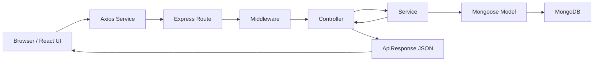
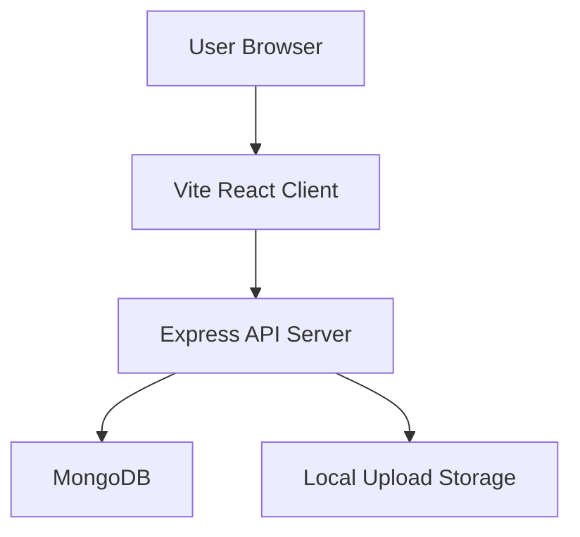
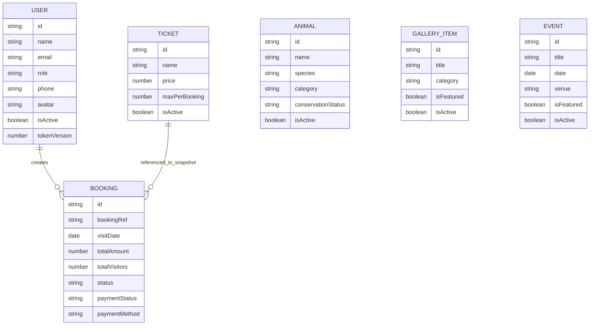
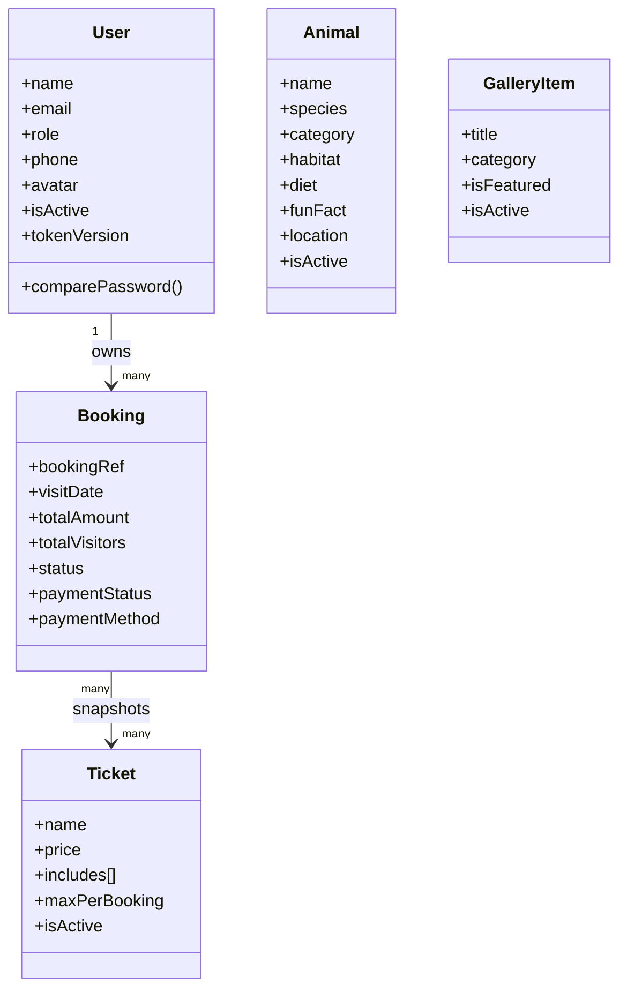
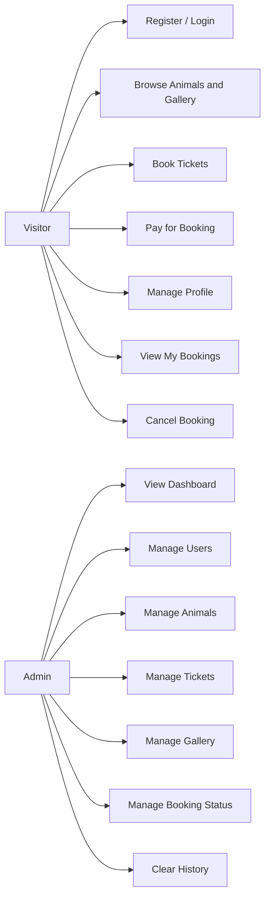
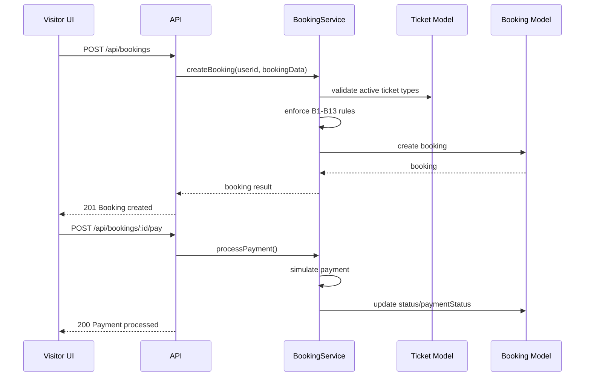
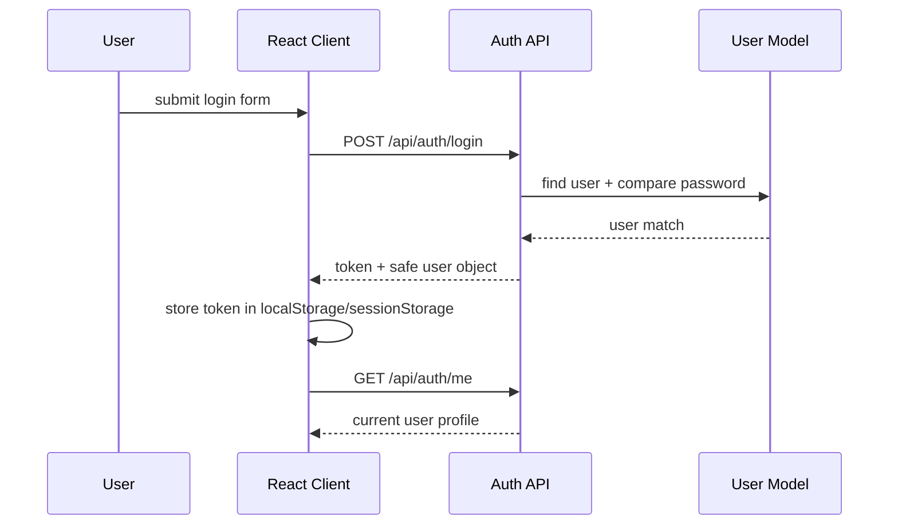

# Lahore Zoo MERN Application

## Handoff Document

### Product Summary
This project is a full-stack Lahore Zoo web application built with a React frontend and an Express + MongoDB backend. It supports public zoo browsing, authenticated visitor accounts, online ticket booking, QR-based booking review, and an admin dashboard for managing animals, users, bookings, tickets, gallery media, and history cleanup.

### Current Release State
- Frontend and backend are both present and wired together.
- Authentication, ticket booking, payment simulation, profile management, admin reporting, and gallery management are implemented.
- The backend follows a layered MVC/N-tier structure: routes -> controllers -> services -> models.
- The frontend is a routed SPA with protected visitor and admin areas.

### Handoff Notes For Developers
- Root workspace uses `npm run dev` to start both client and server concurrently.
- Frontend runs on Vite (`http://localhost:5173`) and proxies `/api` and `/uploads` to the Express server on port `5000`.
- Backend expects MongoDB and uses JWT authentication.
- Uploaded images are stored on disk under `server/uploads`.
- "Delete" actions for animals, gallery items, users, and tickets are usually soft-delete/archive first via `isActive`; permanent deletion is handled from the admin history module.
- `Event` model and seed data exist, but there is no event API route or dedicated event management UI in the current codebase.

### Known Operational Constraints
- Forgot-password OTP is generated and logged to the server console; there is no email/SMS delivery integration yet.
- Contact page is a frontend form and information page only; it does not submit to a backend endpoint.
- Client automated testing currently covers only API response helper smoke tests.
- Server test tooling is configured (`jest`, `supertest`, `mongodb-memory-server`), but no committed test files were found in `server/tests`.

### Seed Accounts
If `npm run seed` is used, the following accounts are created:

| Role | Email | Password |
|---|---|---|
| Admin | `admin@lahorezoo.pk` | `Admin@123` |
| Visitor | `momina@test.com` | `Visitor@123` |
| Visitor | `zain@test.com` | `Visitor@123` |

---

## Release Notes For End Users

### Version
`1.0.0`

### What Users Can Do
- Browse the Lahore Zoo landing page, animal highlights, gallery, guide map, and location information.
- Register and log in as a visitor.
- Recover an account password using OTP-based reset.
- View animal detail pages.
- Book zoo tickets with visit date, ticket selection, visitor information, and payment method.
- Pay using simulated payment flows for Visa, Mastercard, JazzCash, EasyPaisa, or reserve with cash on arrival.
- View active bookings and booking history.
- See booking QR codes and reservation summaries.
- Update profile details, avatar, and password.

### What Admins Can Do
- View dashboard KPIs and analytics charts.
- Manage animals and animal records.
- Manage ticket types.
- Manage users and roles.
- Review and update booking statuses.
- Manage gallery media and featured items.
- Permanently clear archived/history records from dedicated history views.

### Important User-Facing Behaviors
- Past-date bookings are blocked.
- Bookings more than 90 days ahead are blocked.
- Maximum total tickets per booking is 10.
- Booking cancellation is blocked within 24 hours of the visit date.
- Cash-on-arrival bookings stay unpaid until completed by admin.

---

## 1. Project Overview

### Project Name
Lahore Zoo

### Purpose
The system digitizes a zoo visitor experience by combining public information browsing with authenticated ticket reservation and an administrative control panel. Its main goal is to let visitors plan zoo visits online while giving administrators operational visibility over bookings, users, content, and revenue.

### Project Type
Full-stack MERN-style web application:
- MongoDB
- Express
- React
- Node.js

### Main User Roles
- Visitor
- Admin

---

## 2. Technology Stack

### Frontend
- React `19`
- React Router DOM `7`
- Vite `7`
- Tailwind CSS `4`
- DaisyUI
- Axios
- React Hot Toast
- GSAP
- Framer Motion
- Chart.js + `react-chartjs-2`
- `qrcode.react`
- `react-datepicker`

### Backend
- Node.js
- Express `5`
- Mongoose `8`
- JWT (`jsonwebtoken`)
- `bcryptjs`
- `multer`
- `express-validator`
- `helmet`
- `cors`
- `express-rate-limit`
- `express-mongo-sanitize`

### Testing / Dev Tooling
- Jest
- Supertest
- Mongo Memory Server
- Nodemon
- Concurrently

---

## 3. Architecture

### High-Level Architecture
- `client/`: React SPA for public, visitor, and admin interfaces
- `server/`: Express REST API with layered backend design
- MongoDB: persistent data store
- Local uploads: image storage for avatars, animals, and gallery items

### Backend Pattern
The backend follows a practical MVC + N-tier design:
- Routes: URL definitions and middleware composition
- Controllers: request/response orchestration
- Services: business rules and workflow logic
- Models: Mongoose schemas and persistence
- Middleware: auth, RBAC, validation, upload, error handling
- Utils: API response wrapper, API error class, seeding

### Frontend Pattern
- Route-based SPA using `react-router-dom`
- Shared auth state through `AuthContext`
- Axios service layer for API communication
- Protected routes for visitor/admin access control
- Page-level feature modules for booking, profile, admin, and content views

### Request Flow


### Deployment Shape


---

## 4. Implemented Features

### Public Features
- Landing page with hero, about, guide map, feature story sections, animal spotlight, contact, and reach information
- Public gallery page
- Animal detail pages
- Public ticket catalog access
- Public contact information page and form UI

### Visitor Features
- Registration
- Login/logout
- Remember-me session persistence
- Profile fetch/update
- Avatar upload/remove
- Password change
- Forgot password and OTP reset
- Ticket reservation workflow
- Booking payment simulation
- View own bookings by active/history scope
- Cancel eligible bookings
- View QR ticket and booking summary

### Admin Features
- Dashboard analytics
- Revenue report
- Visitor report by ticket type/day
- Booking management and status transitions
- Animal CRUD-style management with soft deletion
- Ticket type management
- User role/status management
- Gallery media management
- History cleanup for bookings, users, animals, gallery, and inactive tickets

---

## 5. Frontend Application Map

### Main Routes

| Route | Access | Purpose |
|---|---|---|
| `/` | Public | Homepage with main marketing/information sections |
| `/gallery` | Public | Gallery wall |
| `/contact` | Public | Contact page |
| `/animals/:id` | Public | Animal detail page |
| `/login` | Public | Login |
| `/register` | Public | Registration |
| `/forgot-password` | Public | OTP reset flow |
| `/profile` | Authenticated | Profile and security settings |
| `/tickets` | Visitor | Ticket booking wizard |
| `/my-bookings` | Visitor | Booking hub with QR display |
| `/admin` | Admin | Dashboard |
| `/admin/bookings` | Admin | Booking operations |
| `/admin/animals` | Admin | Animal management |
| `/admin/animals/new` | Admin | Add animal |
| `/admin/animals/:id/edit` | Admin | Edit animal |
| `/admin/tickets` | Admin | Ticket management |
| `/admin/users` | Admin | User administration |
| `/admin/gallery` | Admin | Gallery media management |
| `/admin/history` | Admin | Permanent cleanup of archived records |

### Important Frontend Modules
- `context/AuthContext.jsx`: session lifecycle and auth actions
- `services/api.js`: Axios instance and interceptors
- `services/apiResponse.js`: API response normalization helpers
- `components/shared/ProtectedRoute.jsx`: route protection
- `pages/Tickets.jsx`: guided booking wizard
- `pages/MyBookings.jsx`: visitor booking list and ticket detail view
- `pages/Profile.jsx`: profile/security management
- `pages/admin/Dashboard.jsx`: analytics UI

---

## 6. Backend API Modules

### Auth API
Base path: `/api/auth`

| Method | Endpoint | Purpose |
|---|---|---|
| `POST` | `/register` | Register visitor |
| `POST` | `/login` | Authenticate user |
| `GET` | `/me` | Get current profile |
| `PUT` | `/me` | Update profile / avatar |
| `DELETE` | `/me` | Deactivate own account |
| `PUT` | `/change-password` | Change password |
| `POST` | `/forgot-password` | Generate OTP reset flow |
| `POST` | `/reset-password` | Reset password with email + OTP |

### Animal API
Base path: `/api/animals`

| Method | Endpoint | Purpose |
|---|---|---|
| `GET` | `/` | List animals with filters/pagination |
| `GET` | `/:id` | Get animal detail |
| `POST` | `/` | Create animal (admin) |
| `PUT` | `/:id` | Update animal (admin) |
| `DELETE` | `/:id` | Soft-delete animal (admin) |

### Ticket API
Base path: `/api/tickets`

| Method | Endpoint | Purpose |
|---|---|---|
| `GET` | `/` | List ticket types |
| `POST` | `/` | Create ticket type (admin) |
| `PUT` | `/:id` | Update ticket type (admin) |

### Booking API
Base path: `/api/bookings`

| Method | Endpoint | Purpose |
|---|---|---|
| `POST` | `/` | Create booking |
| `POST` | `/:id/pay` | Simulate payment |
| `GET` | `/my` | Visitor bookings |
| `GET` | `/all` | All bookings (admin) |
| `GET` | `/:id` | Booking detail |
| `PUT` | `/:id/cancel` | Cancel own booking |
| `PUT` | `/:id/status` | Update booking status (admin) |

### Gallery API
Base path: `/api/gallery`

| Method | Endpoint | Purpose |
|---|---|---|
| `GET` | `/` | List gallery items |
| `GET` | `/featured` | List featured gallery items |
| `POST` | `/` | Add gallery item (admin) |
| `PUT` | `/:id` | Update gallery item (admin) |
| `DELETE` | `/:id` | Archive gallery item (admin) |

### Admin API
Base path: `/api/admin`

| Method | Endpoint | Purpose |
|---|---|---|
| `GET` | `/stats` | Dashboard counters |
| `GET` | `/reports/revenue` | Revenue report |
| `GET` | `/reports/visitors` | Visitor analytics |
| `GET` | `/users` | User list |
| `PUT` | `/users/:id/role` | Change user role |
| `PUT` | `/users/:id/toggle-status` | Activate/deactivate user |
| `DELETE` | `/history/:entity/:id` | Permanently delete one archived record |
| `DELETE` | `/history/:entity` | Permanently clear archived records |

### Utility Endpoint
- `GET /api/health`

---

## 7. Data Model

### Core Models

#### User
- `name`
- `email`
- `password` (hashed, hidden in responses)
- `role` (`visitor`, `admin`)
- `phone`
- `avatar`
- `isActive`
- `tokenVersion`
- `resetPasswordOtpHash`
- `resetPasswordExpires`
- timestamps

#### Animal
- `name`
- `species`
- `category` (`mammal`, `bird`, `reptile`, `aquatic`, `insect`)
- `description`
- `habitat`
- `diet`
- `funFact`
- `imageUrl`
- `galleryImages`
- `location.zone`
- `location.coordinates.x`
- `location.coordinates.y`
- `conservationStatus`
- `isActive`
- timestamps

#### Ticket
- `name`
- `price`
- `description`
- `includes[]`
- `maxPerBooking`
- `isActive`
- timestamps

#### Booking
- `user` reference
- `bookingRef`
- `visitDate`
- `tickets[]` with ticket snapshot fields:
  - `ticketType`
  - `ticketName`
  - `unitPrice`
  - `quantity`
  - `subtotal`
- `totalAmount`
- `totalVisitors`
- `status` (`pending`, `confirmed`, `cancelled`, `completed`)
- `paymentStatus` (`unpaid`, `paid`, `refunded`)
- `paymentMethod`
- `visitors[]`
- `specialRequests`
- timestamps

#### GalleryItem
- `title`
- `description`
- `imageUrl`
- `category` (`animals`, `events`, `habitat`, `aerial`, `visitors`)
- `tags[]`
- `photographer`
- `isFeatured`
- `likes`
- `isActive`
- timestamps

#### Event
- `title`
- `description`
- `imageUrl`
- `date`
- `time`
- `venue`
- `category`
- `isFeatured`
- `isActive`
- timestamps

### Entity Relationship Diagram


### Domain Class View


---

## 8. Business Rules Implemented In Code

### Booking Rules
- `B1`: visit date cannot be in the past
- `B2`: booking cannot be more than 90 days in advance
- `B3`: at least one ticket is required
- `B4`: maximum 10 visitors per booking
- `B5`: ticket quantity must respect ticket `maxPerBooking`
- `B6`: totals are recalculated server-side
- `B7`: visitor detail count must equal total tickets
- `B8`: booking reference is generated uniquely as `LZ-YYYYMMDD-XXXX`
- `B9`: only booking owner or admin can access sensitive booking data
- `B10`: completed/cancelled bookings cannot be cancelled again
- `B11`: cancellation blocked within 24 hours of visit
- `B12`: only active ticket types can be booked
- `B13`: ticket prices are snapshotted at booking time
- `B14`: booking status transitions are restricted

### Payment Rules
- `P1`: payment method must be from allowed set
- `P2`: payment is simulated with delay
- `P3`: only unpaid bookings can be paid
- `P4`: paid cancelled bookings are marked refunded
- `P5`: cash-on-arrival remains unpaid until final completion

### Gallery Rules
- `G1`: image file is required when creating gallery item
- `G2`: uploaded image cleanup occurs when replaced/removed from active use
- `G3`: featured gallery items are capped at 12
- `G4`: category filtering is supported

### Admin Rules
- `AD1-AD5`: dashboard/reporting/user-access rules implemented in `adminService`
- Admin cannot change their own role
- Admin cannot deactivate their own account
- Last active admin cannot be demoted away from admin role

---

## 9. Security Design

### Implemented Controls
- JWT bearer authentication
- Role-based access control for admin-only endpoints
- Password hashing with `bcryptjs`
- Express rate limiting:
  - general API limit
  - stricter login limit
- `helmet` for HTTP security headers
- `express-mongo-sanitize` for request sanitization
- request validation with `express-validator`
- token invalidation through `tokenVersion`
- inactive users blocked from login/use
- upload type restriction to JPEG/JPG/PNG/WEBP
- upload size limit of 5 MB

### Security Notes
- `JWT_SECRET` has a fallback default in code and must be overridden in production.
- OTP reset is console-based only and should be replaced with real delivery for production use.

---

## 10. System Requirements Specification (SRS)

### 10.1 Introduction
The Lahore Zoo system provides digital visitor engagement, ticket reservation, and administrative operations for zoo staff. The system is intended for web access from desktop and mobile browsers.

### 10.2 Scope
The product covers:
- public information access
- account creation and authentication
- reservation and mock payment handling
- user profile maintenance
- admin reporting and content management

The current scope does not include:
- real payment gateway integration
- email delivery service
- event management routes/UI
- contact form backend processing

### 10.3 Stakeholders
- Zoo visitors
- Zoo administrators
- Developers/maintainers

### 10.4 Functional Requirements

#### Visitor Account
- FR-1: users shall be able to register
- FR-2: users shall be able to log in
- FR-3: users shall be able to view their profile
- FR-4: users shall be able to update name, phone, and avatar
- FR-5: users shall be able to change password
- FR-6: users shall be able to deactivate their account
- FR-7: users shall be able to request password reset OTP
- FR-8: users shall be able to reset password with email + OTP

#### Public Browsing
- FR-9: users shall be able to view the homepage
- FR-10: users shall be able to browse gallery media
- FR-11: users shall be able to view animal details
- FR-12: users shall be able to view contact/location information

#### Ticketing And Booking
- FR-13: visitors shall be able to view ticket types
- FR-14: visitors shall be able to create bookings
- FR-15: visitors shall provide visit date, selected tickets, visitor list, and payment method
- FR-16: system shall validate booking rules server-side
- FR-17: visitors shall be able to pay through simulated payment flow
- FR-18: visitors shall be able to view active bookings
- FR-19: visitors shall be able to view booking history
- FR-20: visitors shall be able to cancel eligible bookings

#### Administration
- FR-21: admins shall be able to view dashboard metrics
- FR-22: admins shall be able to view revenue reports
- FR-23: admins shall be able to view visitor analytics
- FR-24: admins shall be able to manage users
- FR-25: admins shall be able to manage bookings
- FR-26: admins shall be able to manage animals
- FR-27: admins shall be able to manage tickets
- FR-28: admins shall be able to manage gallery items
- FR-29: admins shall be able to permanently delete archived records from history

### 10.5 Non-Functional Requirements
- NFR-1: API responses shall use a consistent JSON wrapper
- NFR-2: sensitive routes shall require authentication
- NFR-3: admin operations shall require RBAC checks
- NFR-4: client shall operate as a responsive SPA
- NFR-5: image upload validation shall restrict file size and type
- NFR-6: pagination shall be supported for major list views
- NFR-7: system shall handle invalid routes with 404 JSON response
- NFR-8: error handling shall be centralized on the backend

### 10.6 Assumptions
- MongoDB is available
- browser has JavaScript enabled
- uploads are stored locally on the server
- payment processing is mock only

### 10.7 Constraints
- no external payment gateway
- no email provider integration
- event module is not exposed through routes/UI

---

## 11. UML Diagrams

### Use Case Diagram


### Booking Sequence Diagram


### Authentication Sequence Diagram


---

## 12. Folder Structure

```text
test-project/
├── client/
│   ├── src/
│   │   ├── components/
│   │   ├── context/
│   │   ├── data/
│   │   ├── hooks/
│   │   ├── pages/
│   │   ├── services/
│   │   └── utils/
│   ├── package.json
│   └── vite.config.js
├── server/
│   ├── src/
│   │   ├── config/
│   │   ├── controllers/
│   │   ├── middleware/
│   │   ├── models/
│   │   ├── routes/
│   │   ├── services/
│   │   └── utils/
│   ├── tests/
│   ├── uploads/
│   ├── package.json
│   └── server.js
├── package.json
└── README.md
```

---

## 13. Environment Variables

Backend expects:

| Variable | Purpose | Default In Code |
|---|---|---|
| `PORT` | API port | `5000` |
| `MONGODB_URI` | Mongo connection string | `mongodb://localhost:27017/lahore_zoo` |
| `JWT_SECRET` | JWT signing secret | `default_secret_change_me` |
| `JWT_EXPIRES_IN` | JWT lifetime | `7d` |
| `RESET_TOKEN_EXPIRES_IN` | OTP expiry in ms | `3600000` |
| `CLIENT_URL` | allowed client origin | `http://localhost:5173` |
| `NODE_ENV` | runtime mode | `development` |

Example `server/.env`:

```env
PORT=5000
MONGODB_URI=mongodb://localhost:27017/lahore_zoo
JWT_SECRET=change_this_in_production
JWT_EXPIRES_IN=7d
RESET_TOKEN_EXPIRES_IN=3600000
CLIENT_URL=http://localhost:5173
NODE_ENV=development
```

---

## 14. Setup And Run

### Install Dependencies
```bash
npm install
cd client && npm install
cd ../server && npm install
```

### Start Development
From project root:

```bash
npm run dev
```

### Seed Sample Data
```bash
npm run seed
```

### Build Frontend
```bash
npm run build
```

### Run Tests
```bash
npm test
```

Or separately:

```bash
npm run test:server
npm run test:client
```

---

## 15. Testing Documentation

### Current Automated Tests In Repository

#### Client
- `client/src/services/apiResponse.smoke.js`
- validates:
  - `getApiData`
  - `getApiList`
  - `getApiPagination`
  - `getApiMessage`

#### Server
- test framework is configured in `server/package.json`
- `server/tests/` exists
- no committed Jest/Supertest test files were found at the time of documentation rewrite

### Recommended Test Levels
- unit tests for service-layer business rules
- integration tests for protected routes and booking flows
- UI tests for critical visitor/admin journeys

### Manual Test Cases

| TC ID | Module | Scenario | Expected Result |
|---|---|---|---|
| TC-01 | Auth | Register with valid data | account created and token returned |
| TC-02 | Auth | Register with duplicate email | `409` style conflict response |
| TC-03 | Auth | Login with correct credentials | login succeeds |
| TC-04 | Auth | Login with wrong password | unauthorized error |
| TC-05 | Auth | Forgot password with valid email | success message returned, OTP logged on server |
| TC-06 | Auth | Reset password with valid OTP | password reset succeeds |
| TC-07 | Profile | Upload avatar image | avatar saved and displayed |
| TC-08 | Tickets | Create booking with past date | booking rejected |
| TC-09 | Tickets | Create booking over 90 days ahead | booking rejected |
| TC-10 | Tickets | Book inactive ticket type | booking rejected |
| TC-11 | Tickets | Book more than 10 total visitors | booking rejected |
| TC-12 | Tickets | Visitor count mismatch | booking rejected |
| TC-13 | Payment | Pay with Visa/Mastercard/JazzCash/EasyPaisa | booking becomes `confirmed` and `paid` |
| TC-14 | Payment | Pay with cash on arrival | booking becomes `confirmed` and stays `unpaid` |
| TC-15 | My Bookings | Cancel confirmed booking more than 24h before visit | booking becomes `cancelled` |
| TC-16 | My Bookings | Cancel booking within 24h | cancellation rejected |
| TC-17 | Admin Bookings | Update `pending` to `confirmed` | succeeds |
| TC-18 | Admin Bookings | Update `confirmed` to `completed` | succeeds |
| TC-19 | Admin Bookings | Invalid status transition | request rejected |
| TC-20 | Admin Users | Admin changes another user role | role updates |
| TC-21 | Admin Users | Admin attempts to demote self | request rejected |
| TC-22 | Admin Users | Last admin demotion attempt | request rejected |
| TC-23 | Admin Gallery | Add gallery item without image | request rejected |
| TC-24 | Admin Gallery | Feature more than 12 items | oldest featured item is unfeatured |
| TC-25 | History | Permanently delete archived record | record removed from database |

---

## 16. Traceability Matrix

| Requirement | Implemented In |
|---|---|
| registration/login | `authRoutes`, `authController`, `authService`, `AuthContext` |
| profile management | `authService.updateProfile`, `Profile.jsx` |
| password reset | `forgot-password`, `reset-password` flow |
| ticket booking | `bookingService.createBooking`, `Tickets.jsx` |
| payment simulation | `bookingService.processPayment` |
| booking history | `bookingService.getUserBookings`, `MyBookings.jsx` |
| admin dashboard | `adminService.getDashboardStats`, `Dashboard.jsx` |
| admin user management | `adminService.getUsers/changeUserRole/toggleUserStatus`, `ManageUsers.jsx` |
| animal management | `animalService`, `ManageAnimals.jsx`, `AnimalEditor.jsx` |
| gallery management | `galleryService`, `ManageGallery.jsx` |
| archive cleanup | `adminService.deleteHistoryRecord/clearHistory`, `History.jsx` |

---

## 17. Gaps And Future Improvements

These are grounded in the current codebase:

- add real email/SMS delivery for OTP reset
- add committed backend Jest/Supertest test suites
- add event routes and event management UI for the existing `Event` model
- add real payment gateway integration
- persist contact form submissions
- add audit logs for admin actions
- add deployment-specific storage strategy instead of local upload folders

---

## 18. Conclusion

This repository contains a working Lahore Zoo full-stack web application with a polished visitor-facing frontend and a layered backend that enforces meaningful business rules around authentication, bookings, payments, gallery curation, and admin control. The documentation above is based on the code currently present in the repository, including implemented features, existing limitations, current test state, and dormant modules such as `Event`.
